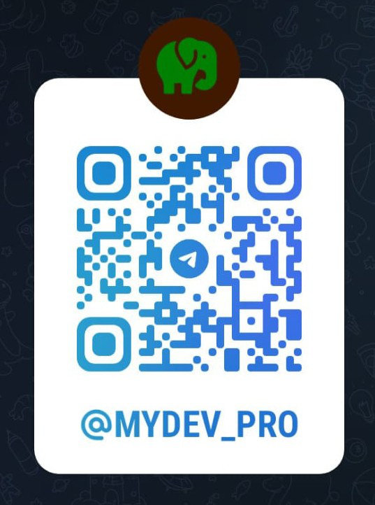

### Hi there 👋
# Hello, I'm Mohamed Youssef. 👋

## About Me
- 👨‍💻 Senior PHP Developer
- 📚 Open-source enthusiast
- 🌍 Reading

## My Skills
- Languages: PHP, JavaScript, SQL, HTML, CSS
- Frameworks: Symfony, Laravel, Laminas, API Framework, Magento, Opencart
- Tools: Linux, PHPStorm, VSCode, Git, GitHub, TWIG
<!--
## Projects
- [Project 1](https://github.com/your-username/project-1)
- [Project 2](https://github.com/your-username/project-2)
-->
## Contact Me

|  |  |
|:--------------------------:|:--------------------------:|
| WhatsApp       | Telegram       |

<!--
**mhmdyoussef/mhmdyoussef** is a ✨ _special_ ✨ repository because its `README.md` (this file) appears on your GitHub profile.

Here are some ideas to get you started:

- 🔭 I’m currently working on ...
- 🌱 I’m currently learning ...
- 👯 I’m looking to collaborate on ...
- 🤔 I’m looking for help with ...
- 💬 Ask me about ...
- 📫 How to reach me: ...
- 😄 Pronouns: ...
- ⚡ Fun fact: ...
-->
